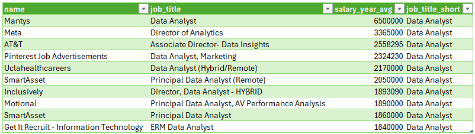
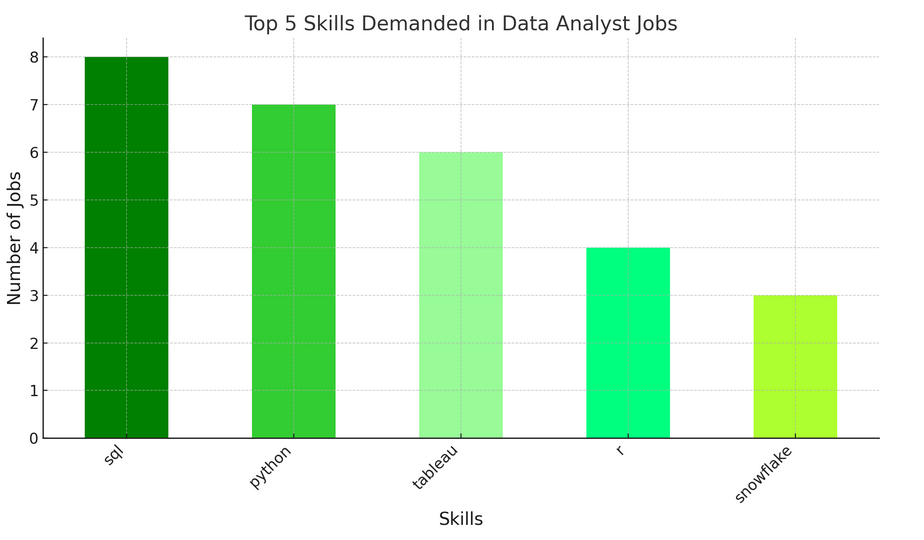
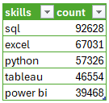

# PostgreSQL Learning
* Following course by [Luke Barousse](https://www.youtube.com/watch?v=7mz73uXD9DA&t=7376s)
* Data is available on this Github and on [Luke's website]( https://lukebarousse.com/sql)
* Progress: 70%
* For extra training, check these PostgreSQL exercises: https://pgexercises.com/

## Proposed exercises
#### Ex.1 - Top paying Data Analyst remote jobs

#### Ex.2 - Skills required for top paying jobs
* with a little help from chatgpt to draw the graph.
* seems like tableau is outpacing power bi

#### Ex.3 - Skills in demand for data analyst

